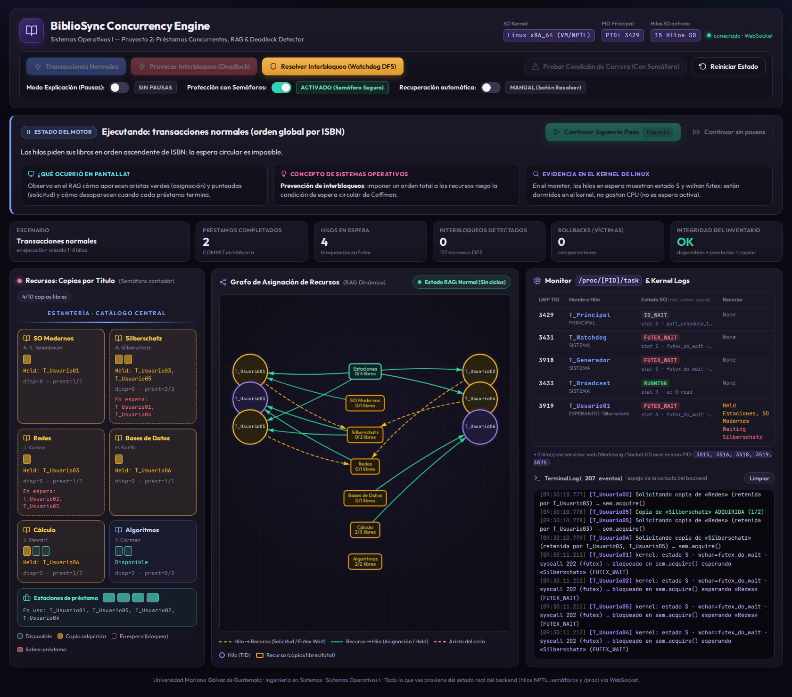
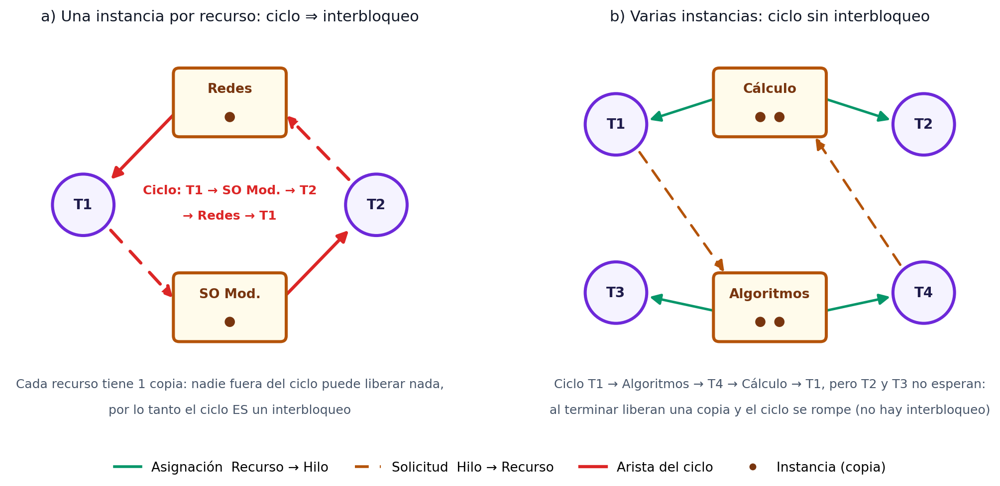
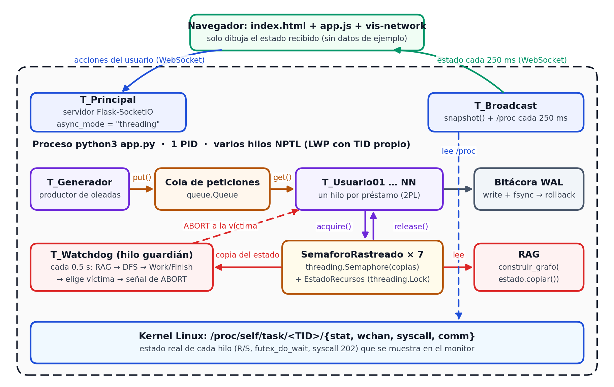
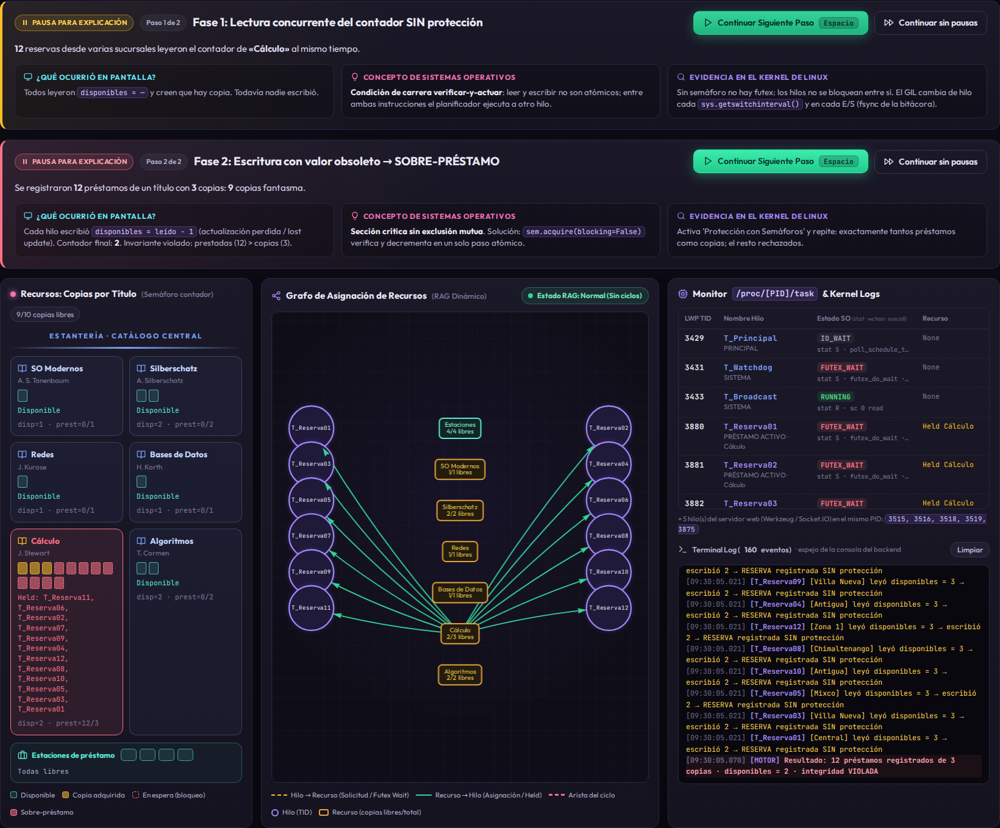
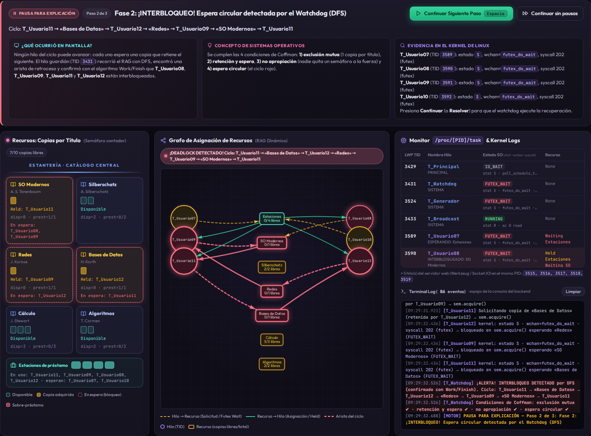

# Proyecto 2 — Motor de Transacciones Concurrentes y Detector de Interbloqueos

**Sistemas Operativos I · Unidades 3 (Concurrencia y Sincronización) y 4 (Interbloqueos)**
Universidad Mariano Gálvez de Guatemala — Centro Universitario de Chimaltenango

> **BiblioSync**: sistema de préstamo de libros de una biblioteca universitaria con varias sucursales
> conectadas al mismo catálogo. Cada solicitud de préstamo es un **hilo real del sistema operativo**
> que compite por copias físicas limitadas.

| Integrantes | Carné |
|---|---|
| 1. | |
| 2. | |
| 3. | |
| 4. | |

---

## 1. ¿Qué hace el proyecto?

1. Cada título del catálogo se protege con un **semáforo contador** `threading.Semaphore(copias)`; las
   estaciones de préstamo son otro semáforo (4 instancias). Un `threading.Lock` protege solo el estado
   interno del que se construye el grafo.
2. **Condición de carrera real**: sin protección, 12 reservas simultáneas de un título de 3 copias
   producen 12 préstamos (9 copias fantasma). Con `acquire(blocking=False)` hay exactamente 3.
3. **Modo caótico**: el generador respeta el orden en que cada usuario pidió sus libros; cuando dos o más
   solicitudes se cruzan, la **espera circular surge sola** (sin `sleep()`).
4. **RAG + watchdog**: el hilo `T_Watchdog` copia el estado real cada 0.5 s, construye el Grafo de
   Asignación de Recursos, busca ciclos con **DFS** y los confirma con el algoritmo **Work/Finish**.
5. **Recuperación**: aborta al hilo que entró más recientemente al ciclo; este hace **ROLLBACK** con la
   bitácora (WAL) y su solicitud se reintenta al final, con el sistema libre y en orden de ISBN.
6. **Panel web en tiempo real** (Flask-SocketIO + vis-network) alimentado por el backend y por
   `/proc/<PID>/task` cada 250 ms.



---

## 2. Marco teórico (resumen)

| Concepto | Idea clave | En el proyecto |
|---|---|---|
| Hilo de kernel (NPTL, modelo 1:1) | Cada `pthread` es una tarea del kernel con TID propio (LWP). | Cada `threading.Thread` aparece en `ps -eLf` y en `/proc/<PID>/task`. |
| GIL de Python | Un hilo ejecuta bytecode a la vez, pero cambia de hilo cada 5 ms y en cada E/S: **no** vuelve atómicas las operaciones compuestas. | La reserva sin protección sufre *lost updates*. |
| Sección crítica | Exclusión mutua, progreso y espera acotada. | Verificar-y-decrementar copias. |
| Semáforo (Dijkstra) | P/`acquire` decrementa o bloquea; V/`release` incrementa y despierta. Contador = N instancias. | Un semáforo por título; valor inicial = copias. |
| Futex | Cerrojo en espacio de usuario; en contención `futex(FUTEX_WAIT/WAKE)`. | Hilos bloqueados: estado `S`, `wchan=futex_do_wait`, syscall 202. |
| 2PL y WAL | Crecimiento (solo adquiere) y decrecimiento (solo libera); bitácora para deshacer. | BEGIN → ADQUIRIDO → COMMIT → DEVUELTO / ABORT → ROLLBACK. |
| Condiciones de Coffman | Exclusión mutua, retención y espera, no apropiación, espera circular. | Las cuatro se cumplen en el modo caótico. |
| RAG (Holt) | Ciclo ⇒ interbloqueo si cada recurso tiene 1 instancia; con varias es necesario pero no suficiente. | DFS encuentra el ciclo; Work/Finish lo confirma. |
| Prevención | Orden total de recursos (Havender). | Modo normal: orden ascendente de ISBN. |
| Detección y recuperación | Detectar periódicamente; terminar/expropiar a una víctima; evitar inanición. | `T_Watchdog` + rollback + reintento ordenado. |



---

## 3. Propuesta (Entregable 0)

- **Escenario**: préstamos combinados (2+ libros) sobre títulos con copias limitadas; los populares tienen 1 copia.
- **Lenguaje / entorno**: Python 3 en WSL2 (Ubuntu), módulo `threading`.
- **Mecanismo**: semáforos por título (recurso contable) + `Lock` para el estado del RAG.
- **Carrera**: verificar-y-actuar con una E/S real (`os.write` + `os.fsync`) entre leer y escribir.
- **Espera circular**: normal = orden por ISBN (imposible el ciclo); caótico = orden de la cola.
- **Detección**: DFS periódico en un hilo guardián sobre un diccionario de adyacencia.
- **Recuperación**: rollback del hilo que entró más recientemente al ciclo.

| Semana | Fechas | Actividades | Entregable |
|---|---|---|---|
| 1 | 28 sep – 4 oct | Repositorio, catálogo, semáforos, bitácora, prueba de carrera | E0 |
| 2 | 5 – 11 oct | Motor 2PL, estaciones, prueba de carga, evidencias `ps`/`/proc` | E1 |
| 3 | 12 – 18 oct | Modo caótico, RAG, watchdog DFS + Work/Finish, rollback | E2 |
| 4 | 19 – 25 oct | Panel Flask-SocketIO + vis-network, modo explicación | E2/E3 |
| 5 | 26 oct – 1 nov | README, Wiki, ensayo y demo en vivo | E3 |

---

## 4. Arquitectura



| Archivo | Responsabilidad |
|---|---|
| `app.py` | Flask-SocketIO (`async_mode="threading"`), hilo `T_Broadcast`, `/api/estado` |
| `motor/recursos.py` | `SemaforoRastreado` (semáforo real + aristas del RAG) y versión sin protección |
| `motor/transacciones.py` | `HiloPrestamo` (2PL, WAL, rollback) y `HiloReservaEnLinea` |
| `motor/generador.py` | Cola de peticiones y `T_Generador` (oleadas, reintentos) |
| `motor/rag.py` | RAG, DFS con colores, Work/Finish |
| `motor/watchdog.py` | `T_Watchdog`: detección, confirmación, víctima |
| `motor/kernel.py` | Lectura de `/proc/self/task/<TID>/{stat,wchan,syscall,comm}` y `prctl` |
| `scripts/evidencia.sh` | Evidencias con herramientas del SO |
| `scripts/prueba_carga.py` | Integridad bajo carga con y sin semáforos |

---

## 5. Resultados

### Condición de carrera (Entregable 1)



| Prueba de carga: 100 hilos × 200 operaciones | Sin protección | Con semáforos |
|---|---:|---:|
| Préstamos realizados | 12 026 | 2 120 |
| Violaciones «prestadas > copias» | **10 448** | **0** |
| Títulos con contador final ≠ copias | 6 de 6 | 0 de 6 |
| Máximo simultáneo de «Redes» (1 copia) | 12 | 1 |
| Resultado | INTEGRIDAD VIOLADA | INTEGRIDAD OK |

### Interbloqueo real, detección y recuperación (Entregable 2)

Ciclo capturado: `T_Usuario11 → «Bases de Datos» → T_Usuario12 → «Redes» → T_Usuario09 → «SO Modernos» → T_Usuario11`



Evidencia externa en el mismo instante (`ps -L -o pid,lwp,nlwp,stat,wchan:24,comm -p <PID>`):

```text
  PID   LWP NLWP STAT WCHAN                    COMMAND
 3429  3431   15 Ssl  futex_do_wait            T_Watchdog
 3429  3524   15 Ssl  futex_do_wait            T_Generador
 3429  3591   15 Ssl  futex_do_wait            T_Usuario09
 3429  3593   15 Ssl  futex_do_wait            T_Usuario11
 3429  3594   15 Ssl  futex_do_wait            T_Usuario12
```

---

## 6. Cómo ejecutarlo (WSL2)

```bash
sudo apt update && sudo apt install -y python3 python3-venv python3-pip htop strace curl
cp -r /mnt/c/Users/<usuario>/Downloads/Proyecto2_BiblioSync ~/
cd ~/Proyecto2_BiblioSync
./run.sh                      # crea .venv, instala y ejecuta → http://localhost:5000
./scripts/evidencia.sh        # (otra terminal) guarda ps -eLf, /proc, top -H, JSON del RAG
python3 scripts/prueba_carga.py
```

**Guion de la demo:** Transacciones Normales (con pausas) → Provocar Interbloqueo → `evidencia.sh`
con el ciclo en pantalla → Continuar/Resolver (rollback) → Condición de carrera sin y con semáforo →
prueba de carga.

---

## 7. Referencias

- Coffman, E. G., Elphick, M. J., & Shoshani, A. (1971). System deadlocks. *ACM Computing Surveys, 3*(2), 67–78.
- Dijkstra, E. W. (1965). *Cooperating sequential processes* (EWD-123).
- Drepper, U., & Molnar, I. (2005). *The Native POSIX Thread Library for Linux*. Red Hat.
- Eswaran, K. P., Gray, J. N., Lorie, R. A., & Traiger, I. L. (1976). The notions of consistency and predicate locks in a database system. *Communications of the ACM, 19*(11), 624–633.
- Franke, H., Russell, R., & Kirkwood, M. (2002). Fuss, futexes and furwocks: Fast userlevel locking in Linux. *Ottawa Linux Symposium*.
- Havender, J. W. (1968). Avoiding deadlock in multitasking systems. *IBM Systems Journal, 7*(2), 74–84.
- Holt, R. C. (1972). Some deadlock properties of computer systems. *ACM Computing Surveys, 4*(3), 179–196.
- Silberschatz, A., Galvin, P. B., & Gagne, G. (2018). *Operating system concepts* (10.ª ed.). Wiley.
- Tanenbaum, A. S., & Bos, H. (2015). *Modern operating systems* (4.ª ed.). Pearson.
- Tarjan, R. (1972). Depth-first search and linear graph algorithms. *SIAM Journal on Computing, 1*(2), 146–160.
