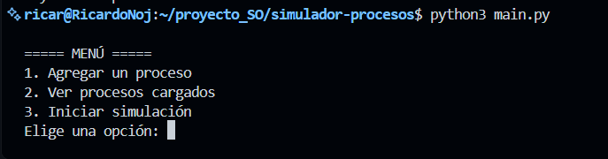
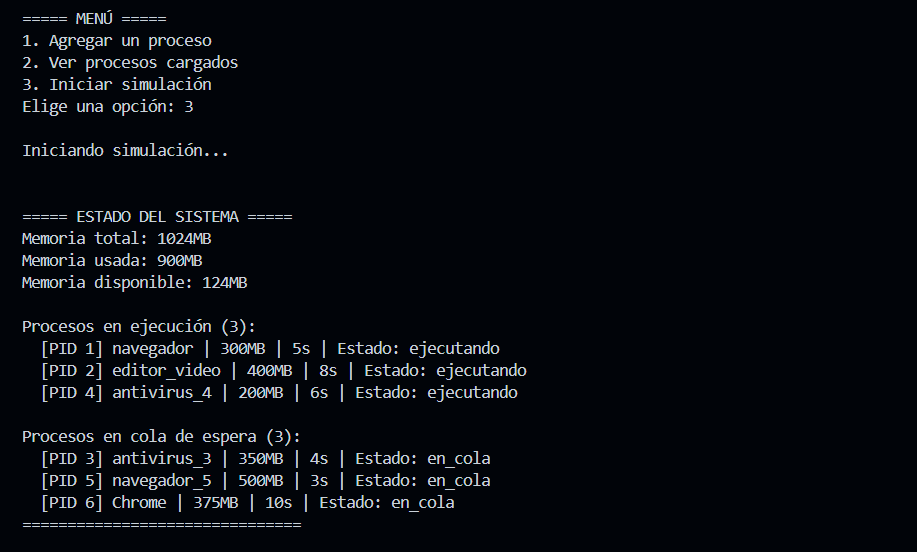
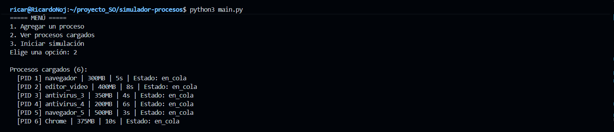
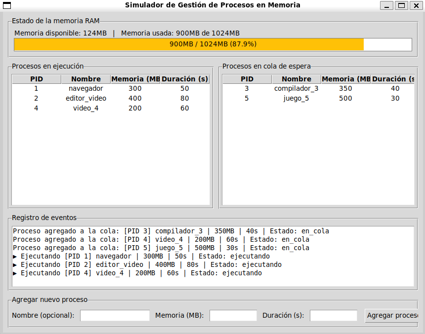
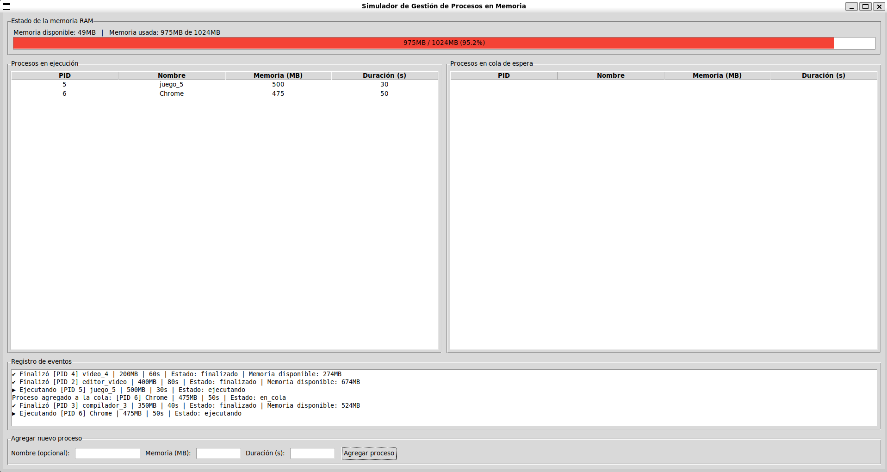
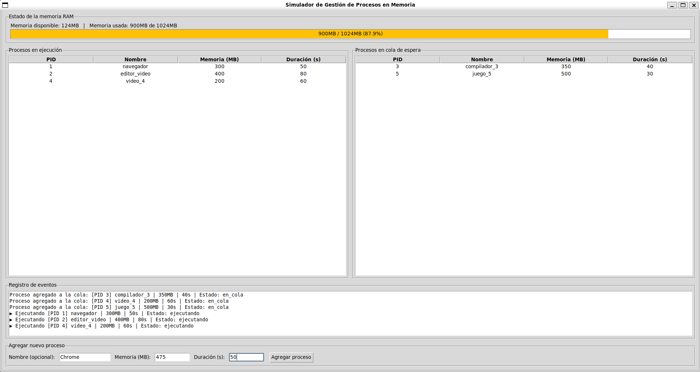
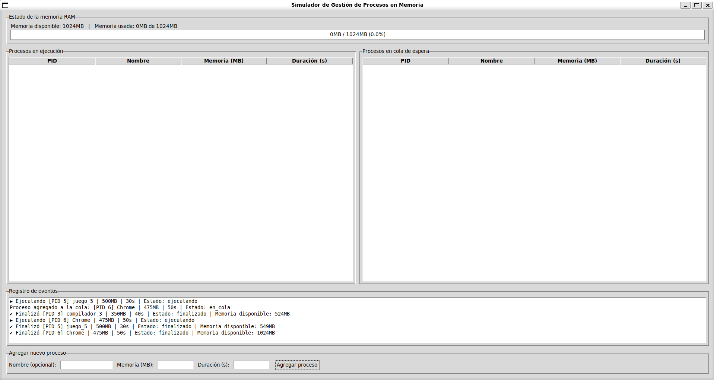

# Simulador de Gestión de Procesos en Memoria

Simulador que representa el comportamiento de un sistema operativo con memoria RAM limitada, gestionando procesos concurrentes, una cola de espera y liberación dinámica de memoria.

## Descripción del proyecto

Este programa simula un sistema operativo simplificado con **1 GB de RAM** y una única CPU. Cada proceso creado tiene un identificador único (PID), un nombre, una cantidad de memoria requerida (en MB) y una duración de ejecución (en segundos).

El sistema:
- Ejecuta procesos de forma **concurrente** mientras haya memoria disponible.
- Coloca en una **cola de espera** a los procesos que no caben en la memoria disponible en ese momento.
- **Libera automáticamente** la memoria de un proceso al finalizar su ejecución.
- Al liberarse memoria, revisa la cola de espera e ingresa a ejecución a los procesos pendientes que ya puedan asignarse.
- Muestra en tiempo real el **estado del sistema**: memoria usada, memoria disponible, procesos en ejecución y procesos en cola.

El proyecto incluye **dos formas de uso**: una versión de consola y una interfaz gráfica de escritorio.

## Tecnologías implementadas

- **Lenguaje:** Python 3
- **Librerías utilizadas** (todas parte de la librería estándar de Python, sin dependencias externas):
  - `threading` — para simular la ejecución concurrente de procesos (cada proceso corre en su propio hilo)
  - `queue` — para implementar la cola de espera (FIFO) de procesos sin memoria disponible, y el registro de eventos de la interfaz gráfica
  - `time` — para simular la duración de ejecución de cada proceso
  - `random` — para generar nombres automáticos cuando no se especifica uno
  - `tkinter` — para la interfaz gráfica de escritorio (barra de memoria, tablas de procesos, formulario)

## Estructura del proyecto
simulador-procesos/
├── main.py # Punto de entrada de la versión de consola
├── main_gui.py # Punto de entrada de la versión gráfica (tkinter)
├── src/
│ ├── proceso.py # Clase Proceso (PID, nombre, memoria, duración, estado)
│ ├── gestor_memoria.py # Clase GestorMemoria (control de RAM disponible/usada)
│ ├── simulador.py # Clase Simulador (cola, ejecución concurrente, eventos)
│ └── interfaz_grafica.py # Clase SimuladorGUI (ventana de tkinter)
├── docs/ # Capturas de pantalla del programa en funcionamiento
├── .gitignore
└── README.md

## Instalación y uso

### Requisitos previos
- Tener Python 3.8 o superior instalado (`python3 --version` para verificar).
- Para la **versión gráfica**, se necesita el módulo `tkinter`. En sistemas basados en Ubuntu/Debian (incluyendo WSL), instálalo con:
```bash
  sudo apt update
  sudo apt install python3-tk -y
```
  Si tu versión de Python es muy reciente y ese comando no encuentra el paquete, usa la versión específica (ej. `sudo apt install python3.14-tk -y`, ajustando el número según tu versión de Python).

### Pasos para ejecutar

1. Clona el repositorio y entra a la carpeta del simulador:
```bash
   git clone https://github.com/davidargel/proyecto_SO.git
   cd proyecto_SO/simulador-procesos
```

2. (Opcional pero recomendado) Crea y activa un entorno virtual:
```bash
   python3 -m venv venv
   source venv/bin/activate
```

3. Ejecuta la versión que prefieras:

   **Versión de consola:**
```bash
   python3 main.py
```

   **Versión gráfica (interfaz de escritorio):**
```bash
   python3 main_gui.py
```

### Cómo usar la versión de consola

Al iniciar, el sistema carga automáticamente 5 procesos de ejemplo y te muestra un menú con 3 opciones:

1. **Agregar un proceso** — te pedirá nombre (opcional), memoria requerida en MB y duración en segundos.
2. **Ver procesos cargados** — lista todos los procesos que serán simulados.
3. **Iniciar simulación** — comienza la ejecución. Verás en tiempo real qué procesos entran a ejecución, cuáles quedan en cola de espera por falta de memoria, y cómo se libera memoria al ir finalizando cada proceso.

### Cómo usar la versión gráfica

Al abrir la ventana, la simulación arranca automáticamente con 5 procesos de ejemplo. La interfaz muestra:

- **Barra de memoria RAM** en la parte superior, que cambia de color según el nivel de uso (verde = disponible, amarillo = ocupada, rojo = casi llena).
- **Tabla de procesos en ejecución** (izquierda) y **tabla de procesos en cola de espera** (derecha), actualizadas en tiempo real.
- **Registro de eventos** mostrando cuándo cada proceso inicia y finaliza.
- **Formulario** en la parte inferior para agregar nuevos procesos mientras la simulación está corriendo (nombre opcional, memoria en MB y duración en segundos).

## Capturas de pantalla

### Versión de consola

**Menú interactivo:**



**Simulación en curso (procesos en ejecución y en cola):**



**Simulación finalizando (memoria liberándose):**


**Lista de procesos cargados:**



### Versión gráfica

**Procesos en ejecución y en cola de espera simultáneamente:**



**Estado de memoria RAM en nivel alto:**



**Formulario para agregar un proceso nuevo:**



**Estado final con todos los procesos finalizados y memoria liberada:**



## Autores

- Ricardo — Desarrollo del simulador (lógica de procesos, memoria, concurrencia e interfaz gráfica)
- [Nombre compañero 1] — Documentación
- [Nombre compañero 2] — Capturas de pantalla y revisión